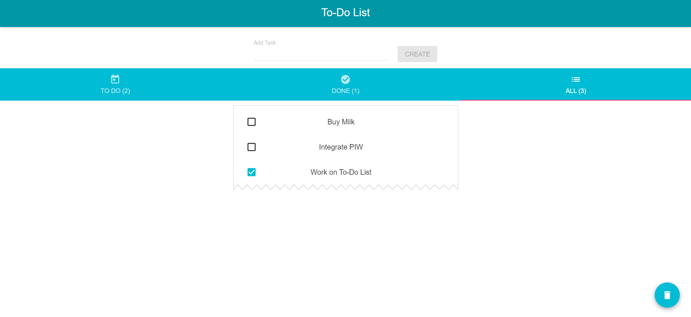

# To-Do List

> This is a simple To-Do list app made with React.
> Live demo [saransh144.github.io/todo-list-react](https://saransh144.github.io/todo-list-react/). <!-- If you have the project hosted somewhere, include the link here. -->

## Table of Contents

- [General Info](#general-information)
- [Tech Stack Used](#tech-stack-used)
- [Screenshots](#screenshots)
- [Setup](#setup)
- [Project Status](#project-status)
- [Contact](#contact)
<!-- * [License](#license) -->

## General Information

- This is a simple To-Do list app made with React.
- All tasks are saved into browser's local storage only.
- Implemented Service Worker to manage a cache of responses in case the user is offline or on slow network.
<!-- You don't have to answer all the questions - just the ones relevant to your project. -->

## Tech Stack Used

- HTML
- CSS
- Javascript
- React

<!-- ## Features

List the ready features here:

- Awesome feature 1
- Awesome feature 2
- Awesome feature 3 -->

## Screenshots



<!-- If you have screenshots you'd like to share, include them here. -->

## Setup

These instructions will get you a copy of the project up and running on your local machine for development and testing purposes.

The project can be built with npm or yarn, so choose one of the approach bellow in case you don't
have any installed on your system.

- npm is distributed with Node.js which means that when you download Node.js,
  you automatically get npm installed on your computer. [Download Node.js](https://nodejs.org/en/download/)

or

- Yarn is a package manager built by Facebook Team and seems to be faster than npm in general. [Download Yarn](https://yarnpkg.com/en/docs/install)

To download the project follow the instructions bellow

```
git clone https://github.com/Saransh144/todo-list-react
cd todo-list-react
```

Install dependencies and run with:

npm

```
npm install
npm start
```

or

yarn

```
yarn install
yarn start
```

<!-- ## Usage

How does one go about using it?
Provide various use cases and code examples here.

`write-your-code-here` -->

## Project Status

Project is: _in progress_

<!--
## Room for Improvement

Include areas you believe need improvement / could be improved. Also add TODOs for future development.

Room for improvement:

- Improvement to be done 1
- Improvement to be done 2

To do:

- Feature to be added 1
- Feature to be added 2
-->

<!--
## Acknowledgements

Give credit here.

- This project was inspired by...
- This project was based on [this tutorial](https://www.example.com).
- Many thanks to...
-->

## Contact

Created by [@Saransh144](https://www.linkedin.com/in/saransh-gupta144/) - feel free to contact me!

<!-- Optional -->
<!-- ## License -->
<!-- This project is open source and available under the [... License](). -->

<!-- You don't have to include all sections - just the one's relevant to your project -->
